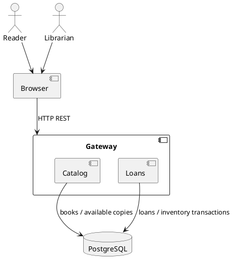
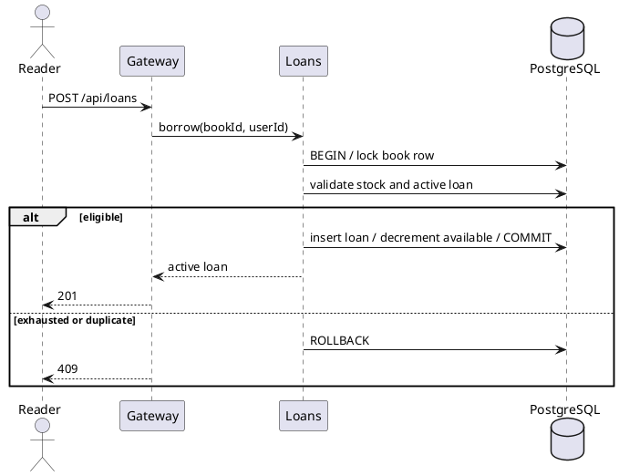
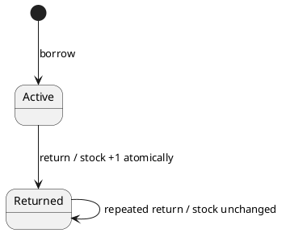

# Library architecture views

## Component view

```plantuml
@startuml
actor Reader
actor Librarian
component Browser
component Gateway {
 component Catalog
 component Loans
}
database PostgreSQL
Reader --> Browser
Librarian --> Browser
Browser --> Gateway : HTTP REST
Catalog --> PostgreSQL : books / available copies
Loans --> PostgreSQL : loans / inventory transactions
@enduml
```

## Borrow sequence

```plantuml
@startuml
actor Reader
participant Gateway
participant Loans
database PostgreSQL
Reader -> Gateway : POST /api/loans
Gateway -> Loans : borrow(bookId, userId)
Loans -> PostgreSQL : BEGIN / lock book row
Loans -> PostgreSQL : validate stock and active loan
alt eligible
 Loans -> PostgreSQL : insert loan / decrement available / COMMIT
 Loans --> Gateway : active loan
 Gateway --> Reader : 201
else exhausted or duplicate
 Loans -> PostgreSQL : ROLLBACK
 Gateway --> Reader : 409
end
@enduml
```

## Loan state

```plantuml
@startuml
[*] --> Active : borrow
Active --> Returned : return / stock +1 atomically
Returned --> Returned : repeated return / stock unchanged
@enduml
```
