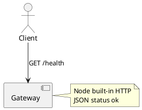

# Health service structure

Origin: operator-authored GUI smoke input.

```plantuml
@startuml HealthService
actor Client
component Gateway
Client --> Gateway : GET /health
note right of Gateway
  Node built-in HTTP
  JSON status ok
end note
@enduml
```
