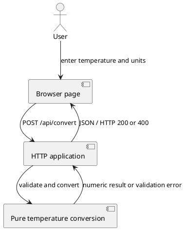

# Temperature converter views

```plantuml
@startuml
actor User
component "Browser page" as UI
component "HTTP application" as HTTP
component "Pure temperature conversion" as Convert
User --> UI : enter temperature and units
UI --> HTTP : POST /api/convert
HTTP --> Convert : validate and convert
Convert --> HTTP : numeric result or validation error
HTTP --> UI : JSON / HTTP 200 or 400
@enduml
```
